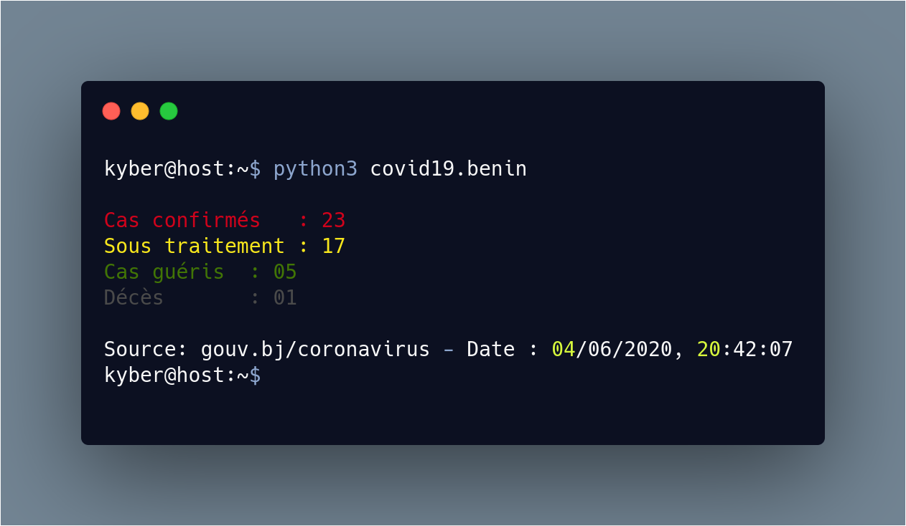
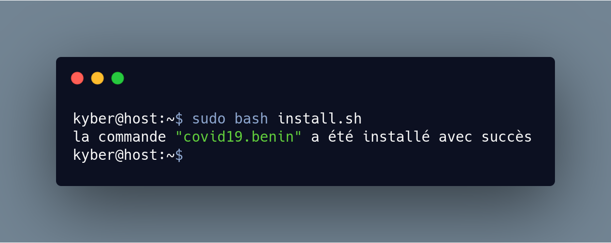
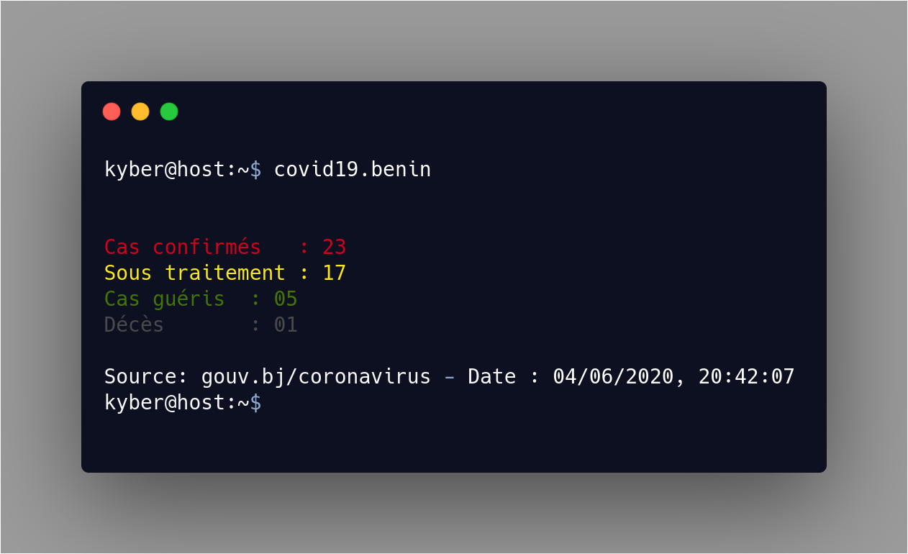

# covid19.benin-cli
Un simple script Python utilisé pour voir les statistiques du Bénin sur le Coronavirus depuis une ligne de commande

# Installation
```bash 
git clone https://github.com/LickosA/covid19.benin-cli.git
cd covid19.benin-cli
pip3 install -r requirements.txt
```

# Obtenir les statistiques
{:height="50%" width="50%"}

# Rendre le script disponible comme une simple commande linux
{:height="50%" width="50%"}

# Exécuter la commande
{:height="50%" width="50%"}

